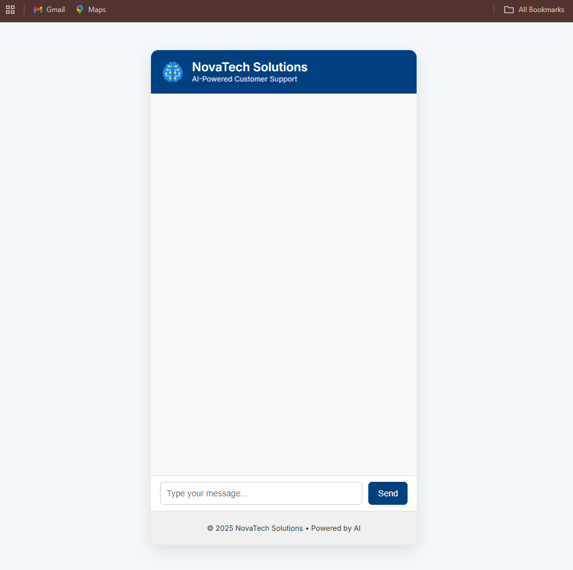
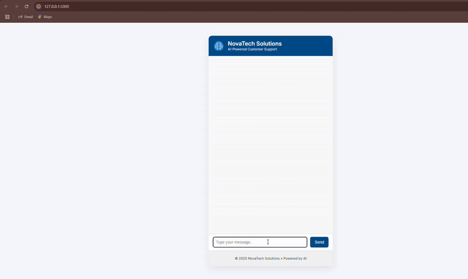

# 🧠 Customer Support Chatbot using NLP (Flask + ML)

This is a professional AI-powered **Customer Support Chatbot** built using rule-based **Natural Language Processing (NLP)** techniques. The bot is designed to handle frequently asked customer service queries such as order status, refund requests, shipping policies, technical issues, and more.

> 📁 Internship Task for Snestron – **Develop an AI-Based Chatbot for Customer Support using NLP**

---

## 🚀 Features

- ✅ Intent recognition using Bag-of-Words + Naive Bayes
- 💬 Interactive chatbot UI using Flask + HTML/CSS
- 🧠 NLP-powered with `intents.json`
- 📦 Handles:
  - Refund requests
  - Order tracking
  - Shipping & cancellations
  - Technical support
  - Product information
  - Feedback collection

---

## 🛠️ Tech Stack

| Tool              | Purpose                            |
|-------------------|-------------------------------------|
| Python            | Programming language                |
| Flask             | Web framework (backend)             |
| HTML/CSS          | Frontend UI                         |
| scikit-learn      | Text classification (Naive Bayes)   |
| CountVectorizer   | NLP text vectorization              |
| JSON              | Intent pattern + response storage   |

---

## 📁 Folder Structure

customer-support-chatbot-using-nlp/
├── app.py
├── chatbot_logic.py
├── intents.json
├── requirements.txt
├── README.md
├── chat-ui.png
├── demo.gif
├── static/
│ └── style.css
└── templates/
└── index.html

## 💻 How to Run Locally

# 1. Clone the repo
git clone https://github.com/Ma4k-23/customer-support-chatbot-using-nlp.git
cd customer-support-chatbot-using-nlp

# 2. (Optional) Create a virtual environment
python -m venv venv
venv\Scripts\activate  # On Windows

# 3. Install dependencies
pip install -r requirements.txt

# 4. Run the Flask server
python app.py
Then go to 👉 http://127.0.0.1:5000 in your browser.

🧠 NLP Flow Summary
All user inputs are matched against pre-trained patterns in intents.json

CountVectorizer is used to convert text into numeric vectors

Multinomial Naive Bayes predicts the most likely intent

A relevant response is selected and returned to the user

## 📸 Screenshots

### Chat UI

### Demo in Action

You can replace chat-ui.png and demo.gif with your own screenshots or recordings.

✅ Certification Note
This repository is submitted as part of the official AI Internship Task at Snestron Internships – focused on building real-world NLP solutions.

“Let’s build, learn, and grow together!” 🚀

